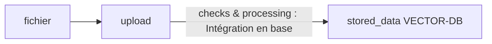
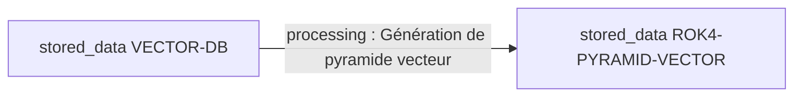
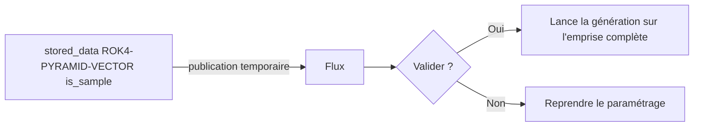

# Workflow

Cette page décrit les différentes étapes de création d'un flux de tuiles vectorielles en les reliant aux entités et concepts de l'API entrepôt.

Pour plus d'information sur les concepts de l'API, se référer à la [documentation de l'API Entrepôt](https://gpf-beta.ign.fr/documentation/)

## 1. Déposer un fichier



Le formulaire de dépôt de fichier va créer une livraison (`upload`). L'utilisateur ne doit renseigner qu'un nom (prérempli à partir du nom du fichier), le fichier à téléverser et la projection (à laquelle il doit veiller particulièrement car elle n'est pas toujours parfaitement lue dans le fichier de données). Le Géotuileur n'envoie à l'API que des livraisons de type `VECTOR`.

L'API va déclencher automatiquement 2 vérifications (`check`) successives sur la livraison :

* vérification standard
* vérification vecteur

Si les 2 vérifications passent avec succès, la page d'intégration lance automatiquement (il ne faut pas que l'utilisateur quitte cette page) le traitement (`processing`) d'intégration en base.

A l'issu de l'intégration, l'utilisateur va trouver sur son tableau de bord, dans les actions à terminer, une ligne qui correspond à une donnée stockée (`stored_data`) de type base de données (`VECTOR-DB`). L'entité livraison (`upload`) est supprimée automatiquement.

La donnée stockée en sortie porte comme étiquettes (`tag`) : l'identifiant de la livraison (`upload_id`)et l'identifiant de l'exécution de traitement (`proc_int_id`). Ces informations conservées tout au long du processus vont permettre par la suite de générer des rapports complets et de mettre à jour les données avec les mêmes paramétrages.

## 2. Créer le flux



A partir d'une donnée stockée (`stored_data`) de type base de données (`VECTOR-DB`), le formulaire de création du flux va lancer le traitement (`processing`) de création d'une pyramide de tuiles vectorielles.

Il est demandé plusieurs informations à l'utilisateur permettant de paramétrer la composition de la pyramide (quels niveaux de zoom, quel contenu attributaire, quelles [options de généralisation](./generalization.md)).

En sortie du traitement, on obtient une donnée stockée (`stored_data`) de type pyramide de tuiles vectorielles (`ROK4-PYRAMID-VECTOR`). Elle se voit associer les étiquettes suivantes, toujours pour permettre la génération de rapports complets et de mettre à jour les données avec les mêmes paramètres :

* `upload_id` : identifiant de la livraison
* `proc_int_id` : identifiant de l'exécution du processus d'intégration en base de données
* `vectordb_id` : identifiant de la base de données
* `proc_pyr_create_id` : identifiant de l'exécution du traitement de génération de la pyramide

La base de données en entrée de ce traitement est supprimée automatiquement.

### Cas de l'échantillon

L'exécution de ce traitement peut être assez longue. Et comme son paramétrage peut s'avérer compliqué, le Géotuileur offre la possibilité de générer un échantillon. Dans ce cas le traitement sera lancé avec comme paramètre supplémentaire une étendue limitée. L'utilisateur peut choisir la position de cette emprise mais pas sa taille qui est contrainte par l'interface à une zone de 10x10 tuiles au niveau de zoom maximum choisit. Un échantillon est donc toujours une donnée stockée (`stored_data`) de type pyramide (`ROK4-PYRAMID-VECTOR`) avec une étiquette (`tag`) supplémentaire `is_sample` qui va lui permettre d'être identifiable dans les actions à terminer du tableau de bord.



### Valider un échantillon (étape facultative)

Quand une donnée stockée est taguée `is_sample`, elle est identifiée comme telle sur le tableau de bord et il est proposé de la valider.

Elle est alors **temporairement publiée** pour être visualisable sur une carte. A partir de cette carte, l'utilisateur se voit proposer de :

* **valider cet échantillon** : la publication temporaire est supprimée et le traitement de génération de la pyramide est relancé avec le même paramétrage mais sans l'étendue limitée.
* **ne pas valider cet échantillon et reprendre le paramétrage** : la publication temporaire est supprimée et l'utilisateur est redirigée vers le formulaire de paramétrage dans les conditions de départ de la phase 2.

## 3. Publier

A partir d'une données stockée (`stored_data`) de type pyramide (`ROK4-PYRAMID-VECTOR`), le formulaire de publication va permettre à l'utilisateur de créer une configuration (`configuration`) et une offre (`offering`).

La pyramide (`stored_data` de type `ROK4-PYRAMID-VECTOR`) se voit ajouter le tag `tms_url` qui contient l'url publique du flux de données publié et un tag `published` true.

> NB : Une publication compte pour 1 dans l'utilisation du quota du `endpoint` `TMS`.

Il est possible de modifier les informations de publication d'un flux déjà publié. Dans ce cas il s'agit d'une dépublication/republication du point de vue de l'API.

## 4. Diffuser

Sur la page de diffusion, l'utilisateur se voit proposer plusieurs URLs qu'il peut partager avec ses utilisateurs finaux. Il n'y a pas d'action en écriture sur l'API lors de cette phase.

Les URLs proposées sont toutes des URLs publiques, c'est à dire accessible sans nécessiter d'authentification :

* URL du flux de données
* URL(s) du ou des styles associés (voir ci-dessous)
* URL du visualiseur (`/viewer`) (partageable tel-quel ou intégrable dans une iframe sur n'importe quel site web)

## 5. Gérer les styles (étape facultative)

Cette phase facultative consiste à fabriquer des fichiers de styles applicables sur la pyramide de tuiles. Elle est parfois nommée "personnalisation" dans l'interface.

> NB : Cette étape est facultative car l'application d'un style sur un flux de tuiles vectorielles pour fabriquer une carte est réalisée par l'application cliente de l'utilisateur final (SIG ou application web par exemple). Le style peut être fourni complètement séparément du flux de données et n'a pas obligatoirement à être géré par le Géotuileur.

L'interface permet de téléverser un fichier de style au format JSON Mapbox et le rendre disponible sur le web via le concept d'annexe (`annexe`) de l'API. C'est le Géotuileur qui décide du chemin d'accès public (`path`) à cette annexe.

Une fois une annexe ajoutée, la donnée stockée se voit ajouter l'identifiant de cette annexe dans son étiquette `styles` qui contient un objet de la forme :

```json
{
    "id du style 1": "nom du style 1",
    "id du style 2": "nom du style 2"
}
```

Un des styles est identifié comme style par défaut dans le tag `default_style`.

Un flux publié et personnalisé dans le tableau de bord est donc une `stored_data` de type `ROK4-PYRAMID-VECTOR` qui possède tous les `tag` suivants :

* `upload_id` : identifiant de la livraison
* `proc_int_id` : identifiant de l'exécution du processus d'intégration en base de données
* `vectordb_id` : identifiant de la base de données
* `proc_pyr_create_id` : identifiant de l'exécution du traitement de génération de la pyramide
* `tms_url` : URL publique du flux de données
* `published` : true
* `styles` : tableau associatif contenant les identifiants des annexes contenant les styles et leurs noms
* `default_style` : identifiant de l'annexe du style par défaut


## Mise à jour d'un flux publié

Grâce aux étiquettes (`tag`) portées par la données stockée (`stored_data`), la mise à jour est en mesure de réexécuter successivement les traitements (`processing`) d'intégration des données en base puis de génération de la pyramide avec le même paramétrage que lors de la première création. L'utilisateur doit donc fournir des données dans le même format, le même schéma et la même projection. Le Géotuileur ne vérifie pas ce prérequis et l'utilisateur ne pourra se rendre compte d'un écart qu'en cas d'échec d'une des vérifications ou d'un des traitement.

Une mise à jour entraine la création d'une nouvelle donnée stocké, identifiée comme étant une mise à jour par un `tag` adéquat.

L'utilisateur peut valider cette mise à jour en visualisant côte à côte :

* la donnée déjà publiée
* la nouvelle donnée publiée temporairement

S'il choisit de valider la mise à jour, l'ancienne donnée est dépubliée et supprimée et la nouvelle donnée est publiée à sa place (avec les mêmes informations de publication : nom, titre, description, mots clés...).

S'il choisit de conserver l'ancienne donnée, alors seule la nouvelle donnée se voit supprimer avec sa publication temporaire.
