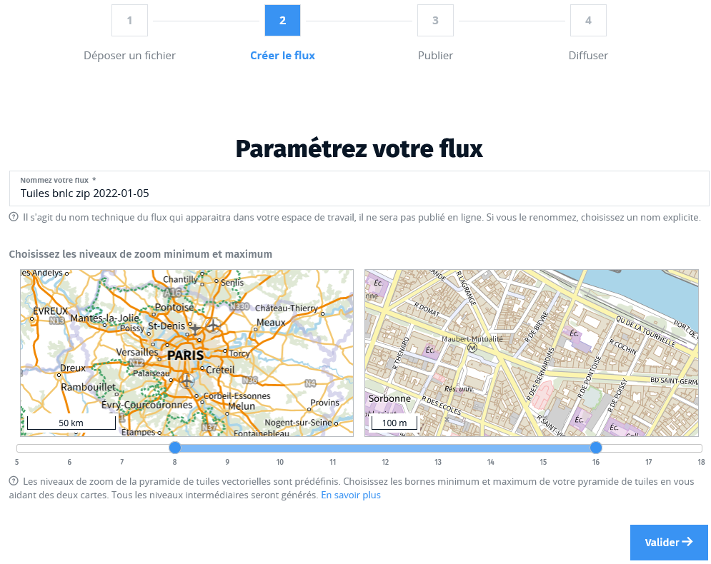
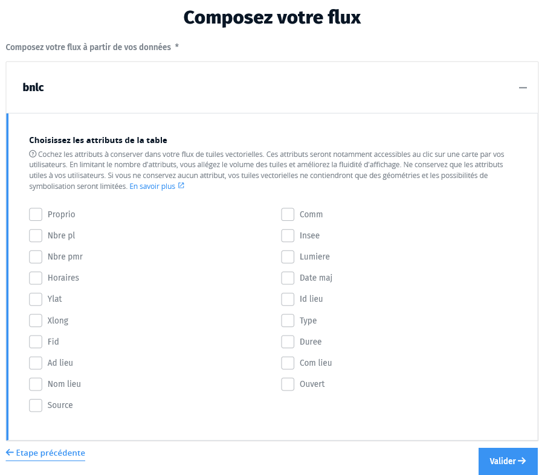
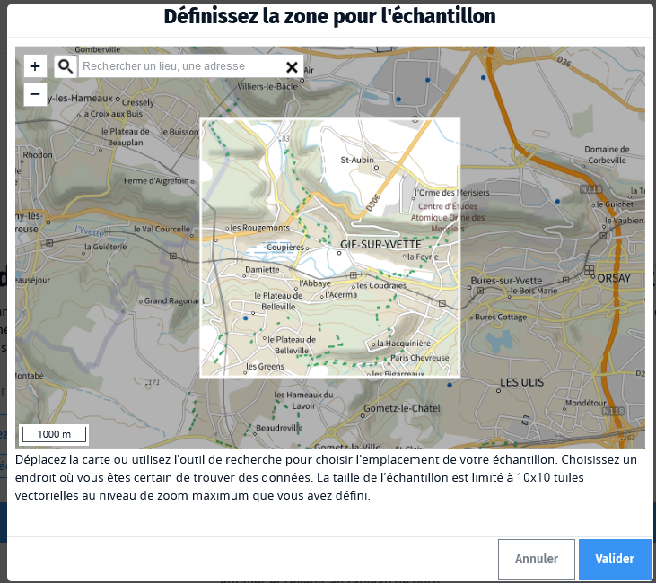

# Créer le flux

Une fois vos données intégrées en base, vous pouvez générer une pyramide de
tuiles vectorielles qui sera la source de votre flux.

Vous pouvez enchainer cette étape directement après le chargement de vos données
ou la réaliser plus tard en retrouvant vos données dans la liste des **actions à
terminer** dans votre tableau de bord.

## Paramétrez votre flux :id=name-and-zoom-levels

Modifiez le nom de votre pyramide de tuiles si le nom proposé par défaut ne vous
convient pas. Comme pour l'étape de dépôt des données, c'est un nom technique qui
vous permettra de retrouver votre travail en cours.

Choisissez ensuite sur quelle plage d'échelles vos données vont être visibles.
Deux vignettes cartographiques permettent de vous rendre compte de la plus
petite échelle (niveau de zoom minimum) et de la plus grande échelle (niveau de
zoom maximum). En d’autres termes, les niveaux de zoom (ou échelle d’affichage)
permettent de préciser à quels niveaux vous allez générer la pyramide.

Au niveau de zoom n+1, il y a 4 fois plus de tuiles à générer qu'au niveau n. Et
le temps de génération de votre pyramide de tuiles et son volume total vont être
directement liés au nombre de tuiles qu'elle va contenir. Il est donc
important de trouver un compromis et de ne pas demander la génération de tuiles
à une échelle inutilement précise.

Il faut bien comprendre que les niveaux de zoom dépendent de l’usage et de
l’étendue de la zone. Par exemple, si l’échelle de travail est départementale,
il n’est pas nécessaire d’avoir un niveau de zoom trop élevé (notamment pour des
raisons de volumétrie des données et de saturation de la bande passante).

## Choisissez les attributs :id=composition

Choisissez les attributs à conserver pour chacune des tables qui composeront votre flux.

Par défaut, aucun attribut n'est coché et vos utilisateurs n'auront donc accès à aucune information sur les objets de cette table. Choisissez judicieusement les attributs qui leur seront utiles ou ceux qui seront utiles à la symbolisation des données (par exemple conservez l'attribut "nature" d'un réseau routier si vous voulez ensuite représenter les routes avec des couleurs et des largeurs différentes selon cette nature).

Notez que plus vous conservez d'attributs, plus le poids de vos tuiles sera élevé, ce qui pourra avoir des conséquences en termes de performances d'affichage. Un grand nombre d'attributs peut aussi diminuer les possibilités de **généralisation** aux petites échelles.

C'est pour ces deux raisons qu'il n'est pas proposé de cocher tous les attributs pour vous inciter à les choisir avec soin.

!> Attention, il n'est pas possible de renommer vos tables et vos attributs. Les noms visibles sont ceux présents dans les fichiers que vous avez téléversés.
Si vous voulez modifier ces noms, vous devrez recharger un nouveau fichier de données. Ces noms peuvent contenir des caractères alphanumériques, des tirets ou des underscores mais pas d'espaces.

Si vos données comportent plusieurs tables, vous pouvez choisir table par table, à quels niveaux de la pyramide elles doivent être utilisées. Par exemple, privilégiez des données précises, telles des bâtiments, à grande échelle ; et des données imprécises ou déjà généralisées, telles des tâches urbaines, à petite échelle.

## Choisissez une option de généralisation :id=generalisation

La **généralisation** en cartographie consiste en une synthèse de l'information, comparable à un résumé de texte. Il s'agit de :

* Réduire la quantité d'information
* Mettre en valeur l'information la plus importante
* Rester fidèle à l'information initiale
* Respecter une bonne lecture de l'information

Ceci peut être réalisé par des opérations de **sélection**, **schématisation** ou **harmonisation**.

* **Sélection qualitative** : on ne retient que les éléments les plus importants (pour se repérer, pour décrire un phénomène)
* **Sélection quantitative** : on ne garde que les éléments les plus importants en termes de taille d'objet ou de classe
* **Schématisation structurale** : on élimine les détails nuisibles, on réunit les objets semblables trop petits, on accentue les détails remarquables
* **Schématisation conceptuelle** : on change le mode de représentation graphique (par exemple une surface devient un point, une surface devient une ligne-réseau en hydrographie, un groupe de point devient une surface)
* **Harmonisation** : on maintient les relations entre les classes d'objets.

En pratique, vos données seront généralisées à certaines échelles (certains niveaux de zoom) surtout pour conserver des poids de tuiles raisonnables, maintenir la lisibilité de vos données et améliorer les performances d'affichage.

Choisissez l'option qui correspond à vos données, notamment à leur type géométrique ou au nombre des attributs que vous souhaitez conserver.

!> La généralisation automatique ne peut pas réaliser certaines opérations. Par exemple, elle ne peut pas transformer un ensemble de bâtiments à grande échelle en une seule surface en forme de _tâche urbaine_ à petite échelle. Pour obtenir un flux de tuiles vectorielles le plus performant possible, il est recommandé de généraliser vos données en amont et de les répartir dans différentes tables que vous répartirez sur les différentes plages d'échelles de votre pyramide.

## Générez un échantillon :id=echantillon

Si vous n'êtes pas sûr de votre configuration, pas de panique ! Vous pouvez générer votre pyramide de tuiles vectorielles sur une petite emprise géographique : un **échantillon**.

Ceci vous permet d'obtenir un aperçu plus rapide de votre flux alors que la génération sur l'intégralité de vos données peut prendre plusieurs dizaines de minutes.

Vous aurez ensuite la possibilité de visualiser votre échantillon et :

* s'il vous convient : de **lancer la génération des tuiles sur toutes vos données**
* s'il ne vous convient pas : de **reprendre la configuration de votre flux**

Vous ne pouvez pas choisir la taille de l'échantillon, cette taille est
contrainte par la plus grande échelle (le niveau de zoom maximum) que vous avez
préalablement choisi (pour générer 10x10 tuiles au niveau de zoom maximum).

Vous pouvez placer cet échantillon où vous souhaitez. Par défaut l'échantillon est placé au centre de l'étendue des données. En tant que connaisseur de vos données, charge à vous de cibler une zone géographique qui sera pertinente. Par exemple, si vos données couvrent la France métropolitaine + les départements d'outre-mer, le centre de l'étendue sera dans le Sahara, où vraisemblablement vous ne trouverez aucune donnée !

**Vous pouvez maintenant lancer la génération !**

!> Attention : le Géotuileur ne vous notifiera pas lorsque la génération de vos tuiles vectorielles sera achevée. Vous devrez revenir consulter le tableau de bord de votre espace de travail

