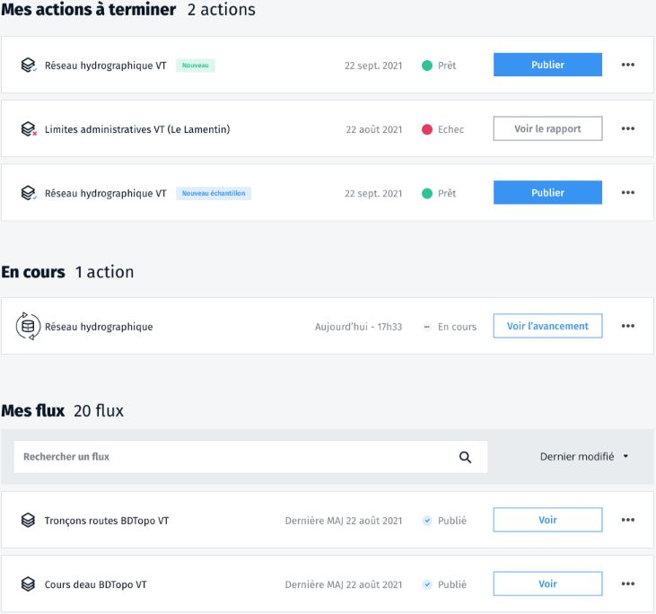

# Modifier les informations de publication d'un flux de tuiles vectorielles

Sur votre tableau de bord, dans la liste de vos flux, vous pouvez cliquer sur le
bouton plus d'actions pour afficher un menu déroulant des actions possibles sur
votre flux.

Choisissez **Modifier les informations de publication**

Vous pouvez modifier toutes les informations de votre flux (titre, description,
mots clés...), y compris son nom technique.

Mais attention, changer ce nom technique modifie l'URL de votre flux. Si vous
l'avez déjà partagé, vos utilisateurs n'y auront plus accès.

