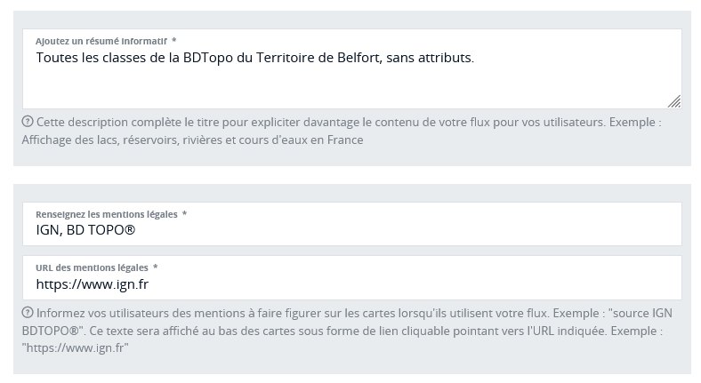

# Publier

Cette étape est très importante pour mettre à disposition de vos utilisateurs un flux compréhensible dont ils pourront tirer le maximum.

Vous devez d'abord donner un nom technique à votre flux : attention, contrairement aux étapes précédentes, cette fois le nom sera visible de vos utilisateurs et présent dans les URL que vous allez lui partager. Ce nom ne doit pas comporter d'espaces ou de caractères spéciaux autres que tirets (`-`), undersocres (`_`) et points (`.`). Il doit également être unique sur le serveur de tuiles vectorielles.

Les autres informations vont permettre aux applications clientes (SIG ou autres) de construire une interface cartographique à partir de votre flux :

- le _titre_ sera le nom sous lequel votre flux apparaitra dans un gestionnaire de couches. Il doit être descriptif tout en restant concis. Il peut contenir des espaces et des caractères spéciaux
- la _description_ peut contenir davantage d'informations que le titre et vous permet d'en dire davantage sur la composition de votre flux, son actualité ou toute autre informations qui serait utile à vos utilisateurs
- les _mentions légales_ (ou informations d'attribution) seront généralement affichées en bas des cartes. Elles sont constituées d'un texte et d'une URL vers laquelle faire pointer ce texte.

Les _mots-clés_ permettent de mieux référencer votre flux dans les catalogues de données. L'autocomplétion des mots-clés utilise un dictionnaire de concepts géographiques issu de la directive européenne INSPIRE. Il est toutefois possible de saisir librement n'importe quelle chaine de caractères comme mot-clé et de valider chaque mot-clé par un appui sur la touche Entrée.

Le flux est désormais bien configuré et prêt à être diffusé.

!> Votre flux publié sera visible immédiatement et publiquement en ligne. Il n'est pas possible de protéger l'accès à votre flux par clé ou mot de passe.
Tout utilisateur qui consomme déjà un autre de vos flux, pourra visualiser le nouveau flux sans nouvelle information de votre part.
