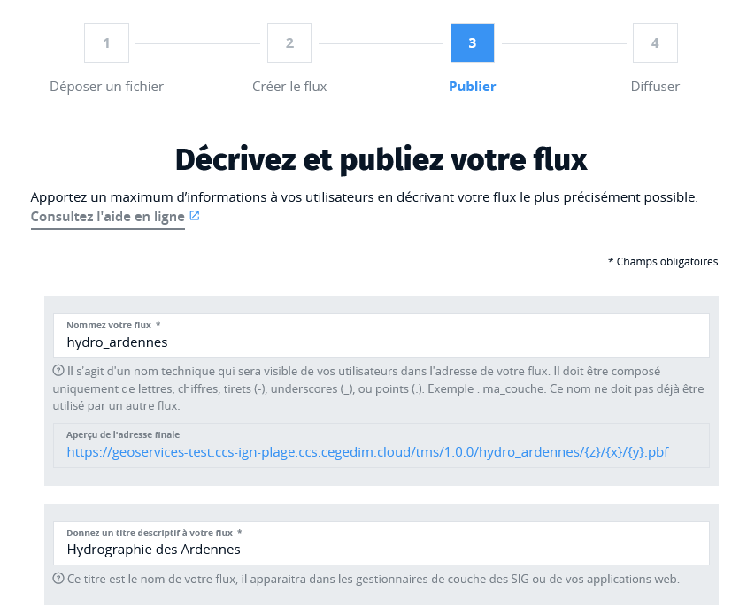
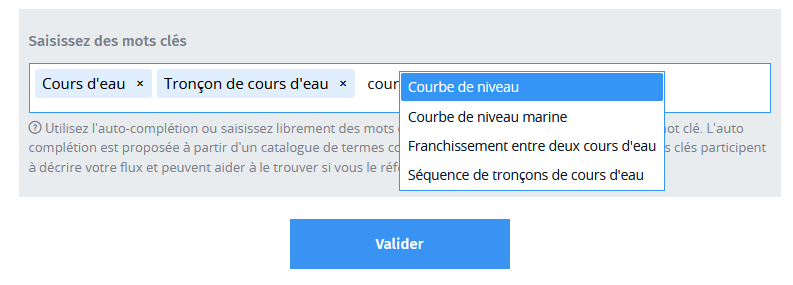

# Publier

Cette étape est très importante pour mettre à disposition de vos utilisateurs un flux compréhensible dont ils pourront tirer le maximum.

Vous devez d'abord donner un nom technique à votre flux, cette fois un nom technique qui sera connu de vos utilisateurs et sera présent dans les URL que vous allez lui partager.

Les autres informations vont permettre aux applications clientes (SIG ou autres) de construire une interface cartographique à partir de votre flux, par exemple le titre sera le nom sous lequel votre flux apparaitra dans un gestionnaire de couches et les mentions légales (ou informations d'attribution) seront affichées en bas des cartes. Ne négligez pas leur remplissage.

Les mots clés permettent de mieux référencer votre flux dans les catalogues de données. L'autocomplétion des mots clés utilisent un dictionnaire de concepts géographiques issu de la directive européenne INSPIRE. Il est toutefois possible de saisir librement n'importe quelle chaine de caractères comme mot clé et valider chaque mot clé par un appui sur la touche Entrée.

Le flux est désormais bien configuré et prêt à être diffusé.

!> Votre flux publié sera visible immédiatement publiquement en ligne. Il n'est pas possible de protéger l'accès à votre flux par clé ou par de mot de passe.
En particulier, tout utilisateur qui consomme déjà un autre de vos flux, pourra visualiser le nouveau flux très facilement sans nouvelle information de votre part.
