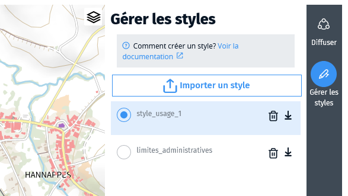
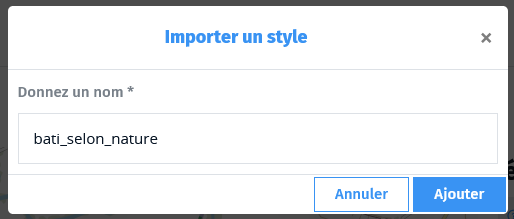

# Gérer les styles

Par défaut, votre flux est représenté sur les cartes en filaire de couleur bleue.

Pour personnaliser ce rendu, vous devez associer un fichier de style à votre flux. Ce fichier doit décrire les couleurs, tailles de tracés, opacités (...) à appliquer à chacun des objets de votre flux et selon quels critères attributaires.

!> Le Géotuileur ne permet aujourd'hui d'utiliser que des fichiers de style **au format Mapbox JSON**. Il vous faut préparer ces fichiers avec un autre logiciel (par exemple [Maputnik](https://maputnik.github.io/)).

## Importer un fichier de style

Un menu latéral à droite propose une option de personnalisation. Pour y accéder, cliquez sur **Gérer les styles**.

Cliquez ensuite sur **Importer un style** et choisissez un fichier au format Mapbox JSON.

Nommez ce nouveau style pour le retrouver plus facilement dans la liste des styles.

Si le fichier de style est adapté à vos données, l'affichage de la carte se met à jour et vous devriez voir apparaitre vos données selon les représentations décrites dans le fichier de style.

!> Attention : si votre fichier de style n'est pas adapté à vos données, vous les verrez disparaitre (partiellement ou totalement) de la carte sans que ceci ne soit considéré comme une erreur. Si aucun filtre de votre fichier de style ne correspond à un objet donné, celui-ci n'est pas affiché. _Par exemple, si votre fichier de style prévoit l'affichage d'objets portant un champ nature avec pour valeur "commercial" mais qu'aucun objet ne porte ce champ avec cette valeur, votre fichier de style ne permettra pas de représenter vos données._
## Modifier ou supprimer un fichier de style

Vous ne pouvez pas modifier un style existant dans le Géotuileur. Vous devez le modifier à l'aide du logiciel de votre choix et le réimporter.

Vous pouvez supprimer un style définitivement en cliquant sur la poubelle à côté de son nom.

## Fonctionnalités à venir

> Des évolutions sont en cours de développement pour permettre :
>  * d'importer des fichiers de style dans d'autres formats que le JSON,
>  * de manipuler les styles directement dans le Géotuileur.