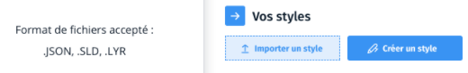

# Gérer les styles

Par défaut, votre flux est représenté sur les cartes en filaire de couleur bleue.

Pour personnaliser ce rendu, vous devez associer un fichier de style à votre flux. Ce fichier doit décrire les couleurs, tailles de tracés, opacités... à appliquer à chacun des objets de votre flux et selon quels critères attributaires.

Le Géotuileur ne permet aujourd'hui d'utiliser que des fichiers de style au format Mapbox JSON. Il vous faut prépare ces fichiers avec un autre logiciel

## Préparer un fichier de style

?> Documentation à venir 
## Importer un fichier de style

Il est possible d’importer un fichier de style comme suit :

Dans l’onglet “Vos styles”, il est possible de modifier, exporter, renommer ou
supprimer un style :

La suppression du fichier style implique ainsi un affichage non-symbolisé des
données brutes (contours bleus par défaut).

## Modifier ou supprimer un fichier de style

Vous pouvez supprimer un style définitivement en cliquant sur la poubelle à côté de son nom.

Vous ne pouvez pas modifier un style existant. Vous devez reprendre le fichier de style à l'aide du logiciel de votre choix et le réimporter.

## Fonctionnalités à venir

> Des travaux sont en cours pour permettre :
>  * d'importer des fichiers de style dans d'autres formats 
>  * de manipuler les styles directement dans l'interface graphique.