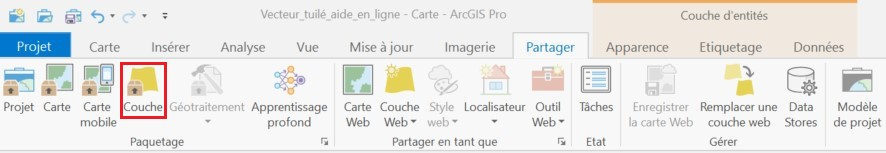
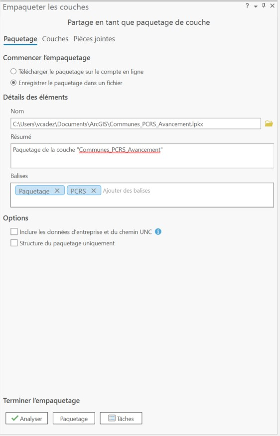

# Préparer un fichier Geopackage avec ArcGIS

Allez dans l'onglet **Partager** puis cliquez sur l'option **Couche** dans le groupe **Paquetage**.

Remplissez ensuite les champs dans la fenêtre "Empaqueter les couches" qui s'affiche et indiquer l'emplacement où vous voulez déposer votre paquetage. 

Cliquez ensuite sur **Paquetage**.