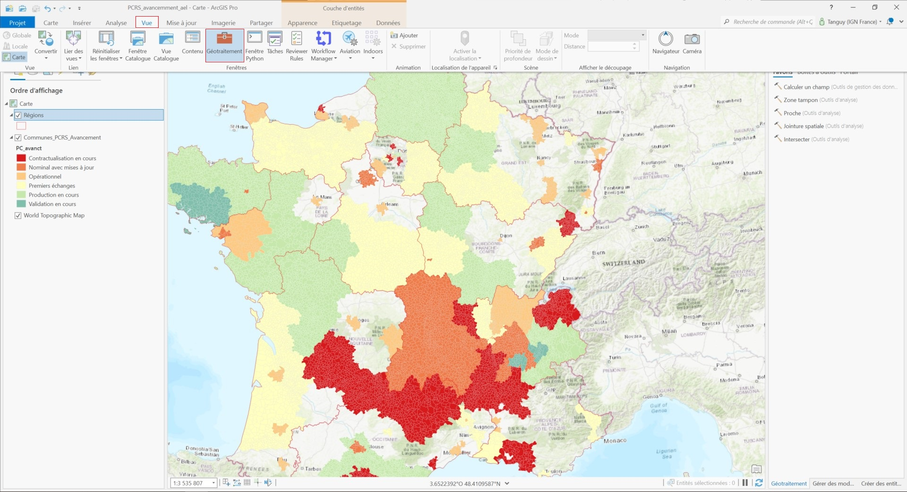
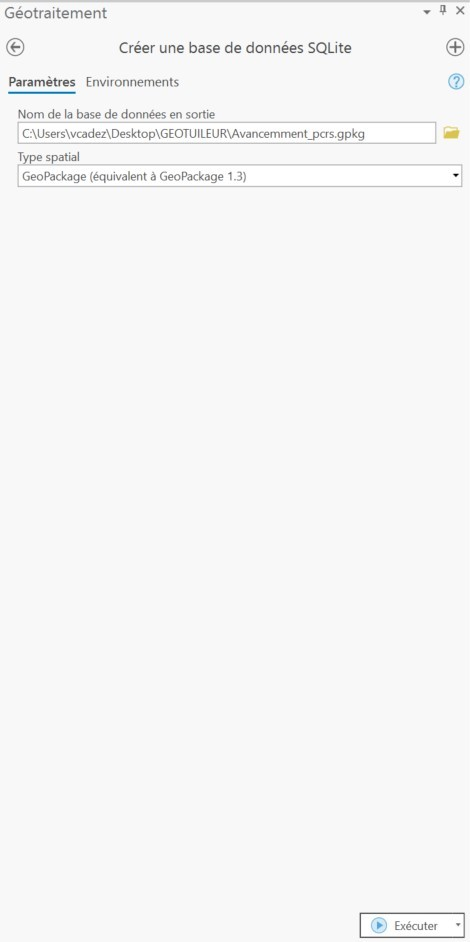
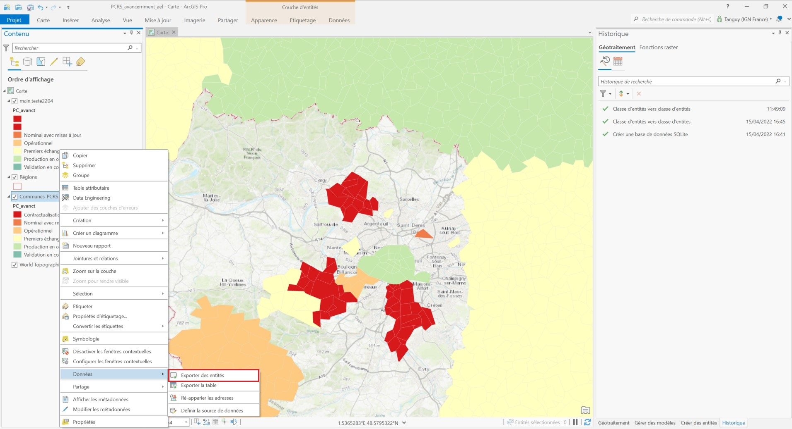
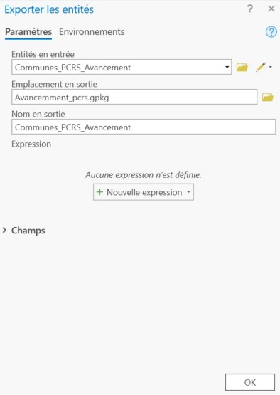

# Préparer un fichier Geopackage avec ArcGIS Pro

Ouvrez le volet **Géotraitement** de votre projet ArcGIS en cliquant sur le bouton **Outils** de l'onglet **Analyse**. Dans la zone de recherche,  tapez **"Créer une base de données SQLite"** puis sélectionnez le premier outil. 

Renseignez **l'emplacement** ainsi que le **nom de sortie** que vous désirez pour votre fichier. 

Cliquez ensuite sur **Exécuter**.

Une fois le geopackage crée, il faut exporter les entités de la couche dans celui-ci. Pour cela, faites un **Clic droit** sur la couche souhaitée, puis dans **Données**, sélectionnez **Exporter des entités**. 

Renseignez le nom en sortie et dans **Emplacement en sortie**, indiquez le geopackage crée précédemment puis cliquez sur **Ok**.

Vous pouvez maintenant intégrer votre geopackage zippé dans le Géotuileur. 