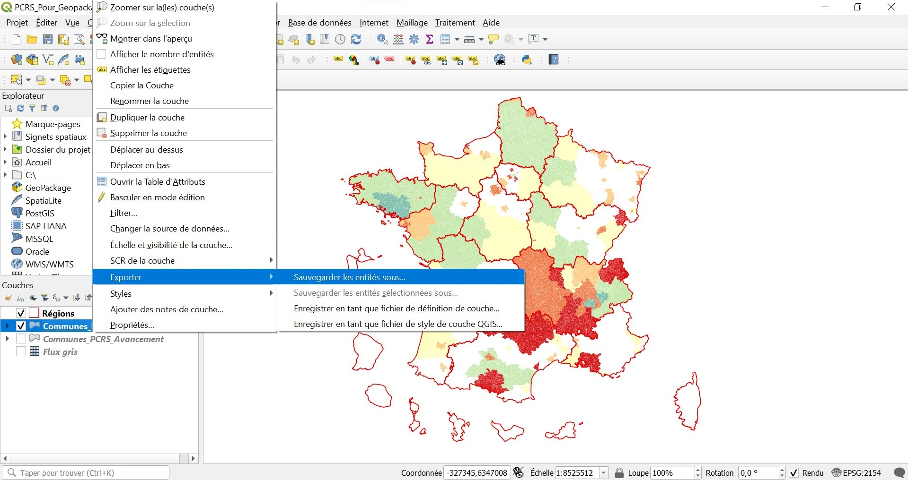
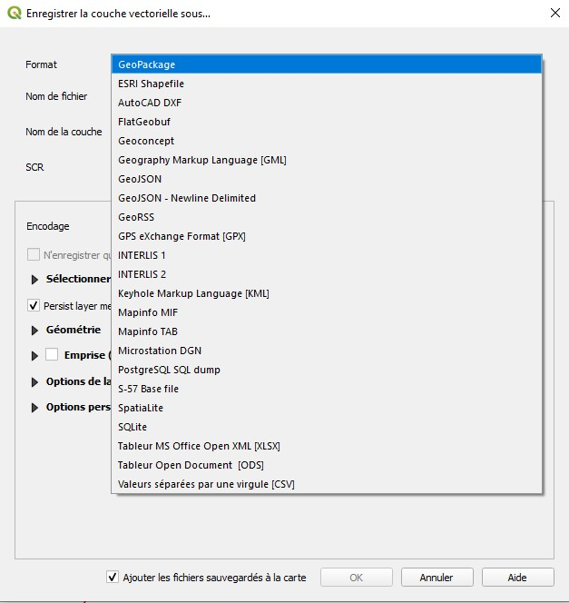
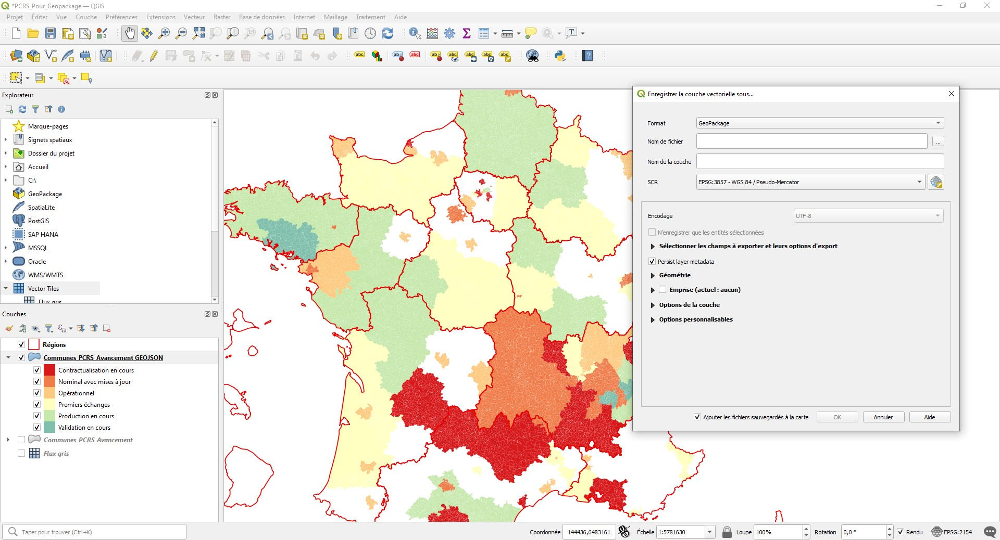

# Préparer un fichier Geopackage avec QGIS

Pour obtenir une couche déjà existante en Geopackage dans **QGIS**, vous devez vous rendre sur la couche que vous voulez exporter en .gpkg, **clique droit** et sélectionnez **Exporter** puis, **Sauvegarder les entités sous...**.

Une fenêtre s'ouvre puis dans **Formats**, sélectionnez **Geopackage**. 

Renseignez par la suite les champs nécessaires et cliquez sur **Ok**. La couche est maintenant exportée en Geopackage. 

Pour ajouter une couche à un fichier Geopackage déjà existant, il suffit de faire la même chose et dans **Nom de fichier**, cliquez sur le bouton **...** et indiquez le fichier Geopackage déjà existant.