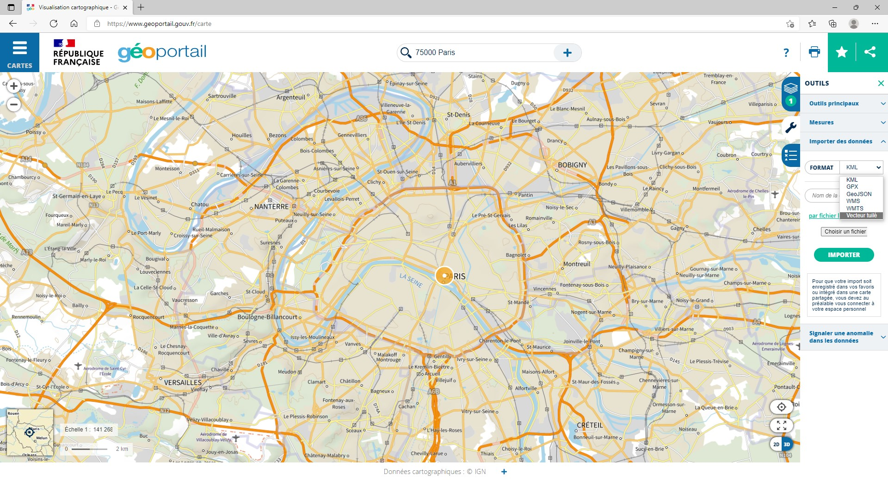

# Utiliser un flux de tuiles vectorielles sur le Géoportail

Rendez vous sur le site internet https://www.geoportail.gouv.fr/. 

Dans les outils, sélectionnez **Importer des données** et choisissez le format **Vecteur tuilé**. Copiez collez ensuite le lien du style de votre flux de tuiles vectorielles dans l'espace indiqué et cliquez sur **Importer**.