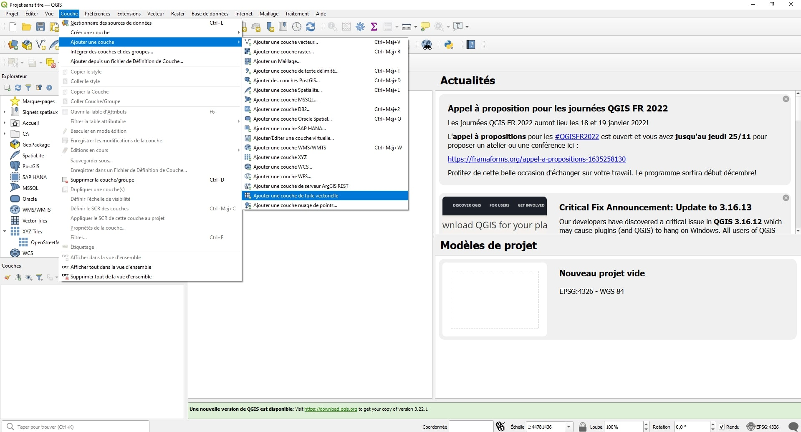
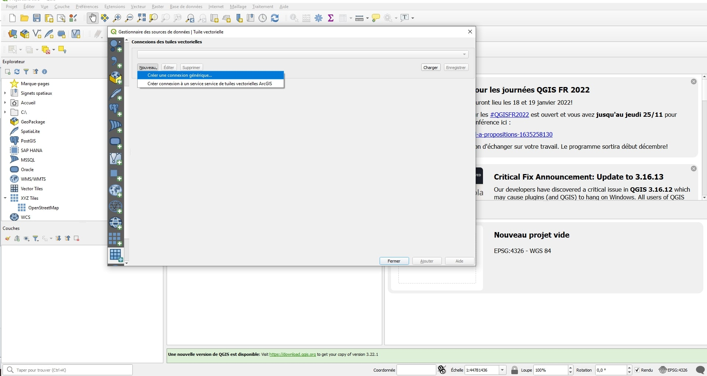
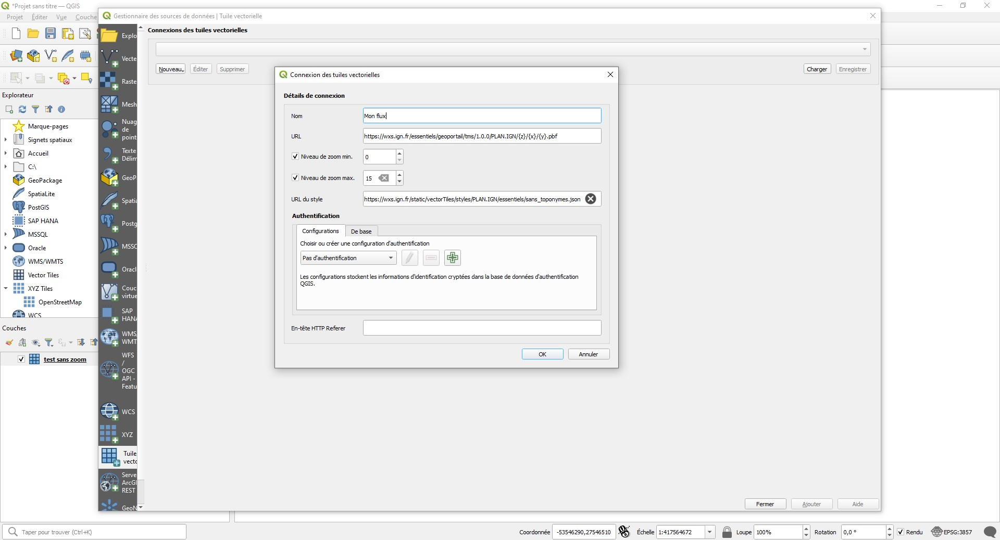
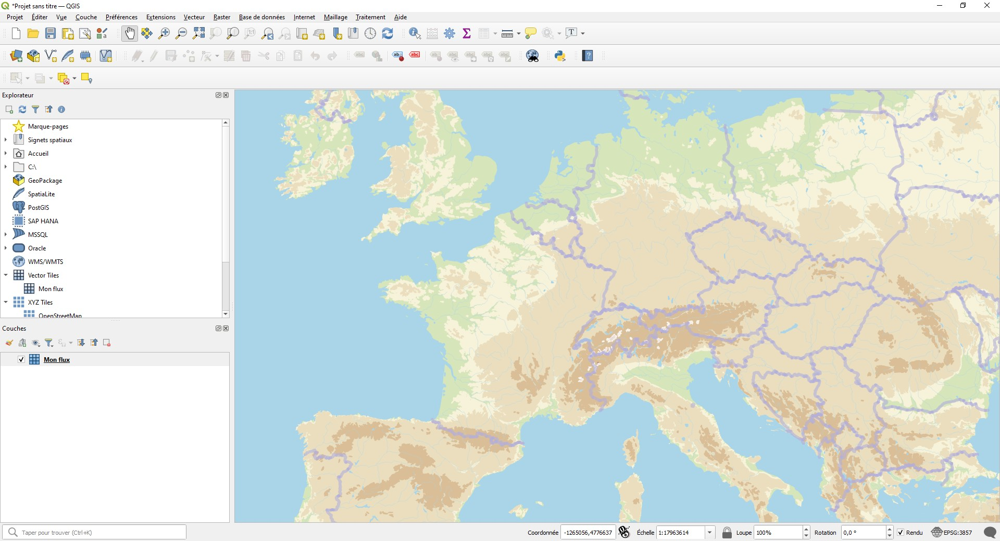

# Utiliser un flux de tuiles vectorielles dans QGIS

Pour exploiter une URL dans le logiciel QGIS il faut se rendre dans le menu **Couche**, puis sur **Ajouter une couche** et **Ajouter une couche de tuile vectorielle**.

Ensuite, cliquez sur **Nouveau** et **Créer une connexion générique**.

Remplissez les champs indiqués :

**Nom** : le nom que vous voulez donner à votre couche tuile vectorielle

**URL** : coller l'URL voulu pour le fond de carte [https://wxs.ign.fr/essentiels/geoportail/tms/1.0.0/PLAN.IGN/{z}/{x}/{y}.pbf] ou [https://wxs.ign.fr/cartes/geoportail/tms/1.0.0/PLAN.IGN/{z}/{x}/{y}.pbf] 

**Niveau de zoom** : il est obligatoire d'indiquer un niveau de zoom afin d'ajouter la couche vectorielle sur QGIS. Vous pouvez entrer le niveau de zoom précédemment renseigné lors de la création sur le géoservice.

**URL du style** : coller l'URL obtenue après la création de votre flux avec le service Géotuileur

Pour valider vos choix faites **Ok** et cliquez sur **Ajouter**.

Voilà, vous avez ajouté votre couche personnalisée de tuile vectorielle sur votre projet QGIS.