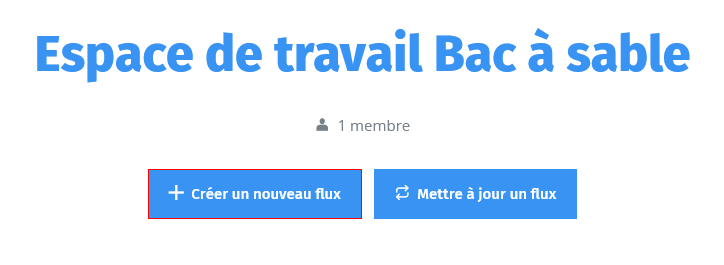
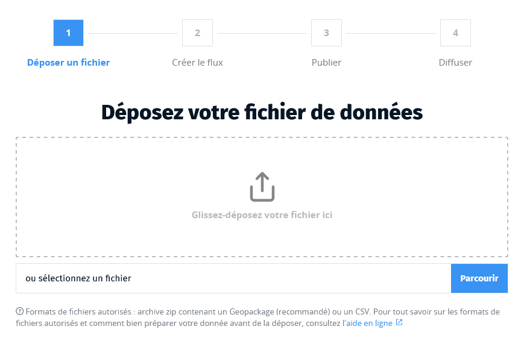
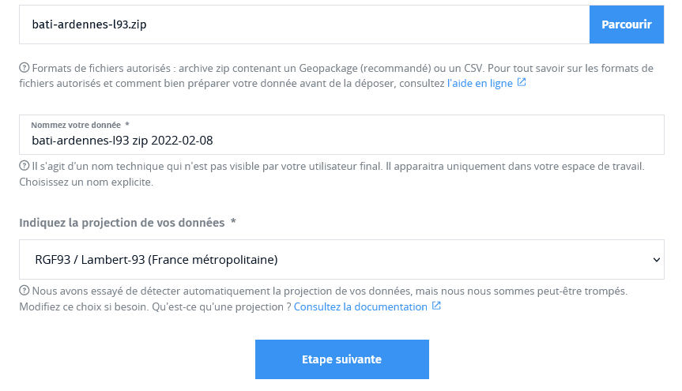

# Déposer un fichier

A partir du tableau de bord de votre espace de travail, commencez le dépôt de
fichier en cliquant sur **Créer un nouveau flux**.

## Préparer un fichier de données

Le Géotuileur ne permet de traiter et diffuser que des données vecteur et **le format Geopackage en particulier est recommandé** car il permet d'enregistrer plusieurs couches de données et est moins ambigü sur la définition des géométries.

* [Préparer un fichier Geopackage avec QGIS](./tutos/gpkg-qgis.md)
* [Préparer un fichier Geopackage avec Arcgis](./tutos/gpkg-arcgis.md)

Il est également possible de partir d'un fichier au format **CSV**.

!\> Quel que soit le format, les noms des couches et des champs doivent être composés uniquement de
caractères alphanumériques (espace et caractères spéciaux non autorisés).

Si vous préférez le format CSV, quelques contraintes supplémentaires sont à prendre en compte :

-   le champ portant la géométrie des objets doit s'appeller `wkt` et être au
    format [Well Known Text](https://fr.wikipedia.org/wiki/Well-known_text)

-   la virgule `,` est le seul séparateur valide

## Compressez le fichier

Quel que soit le format de votre fichier, il est recommandé de le compresser dans une archive `.zip` pour réduire son poids et faciliter son transfert sur le Géotuileur.

## Téléversez le fichier de données :id=upload

Modifiez le nom de votre nouvelle donnée si celui-ci ne vous convient pas. Ce
nom n'est pas celui que verront les utilisateurs de votre flux mais un
nom technique qui vous permettra de retrouver votre travail en cours sur le
tableau de bord de votre espace de travail.

> Notez par ailleurs que le Géotuileur ne permet pas le moissonnage de flux : si
vos données se trouve sur un autre serveur accessible publiquement, il
vous faut dans un premier temps les télécharger sur votre
machine et les transformer dans un format compatible avec le Géotuileur pour pouvoir les téléverser.

## Associez une projection :id=projection

Le Géotuileur détecte automatiquement la projection de vos données. Mais il peut arriver que cette détection soit erronnée. Vérifiez soigneusement la projection avant de passer à l'étape suivante.

?> En cartographie, une projection est l'ensemble des techniques permettant de représenter la surface de la Terre dans
son ensemble ou en partie sur la surface plane d’une carte. D’un point de vue
mathématique, la projection est l’équation de correspondance entre la surface de
la Terre et le plan. Pour plus d’informations, se référer
[ici](pdf/projections_cartographiques.pdf ':target=_blank :ignore').

Si la projection de vos données ne figure pas dans le menu déroulant, vous pouvez reprojetez vos données à l'aide d'un logiciel SIG avant de les déposer à nouveau. Vous pouvez également nous signaler une projection que vous souhaiteriez voir ajouter au menu via le formulaire de contact.

**Vous pouvez maintenant passer à l'étape suivante !**

Patientez ensuite quelques instants en attendant que vos données soient successivement téléversées, vérifiées puis intégrées en base.

!> Ne quittez pas la page tant que les différentes étapes ne sont pas terminées
