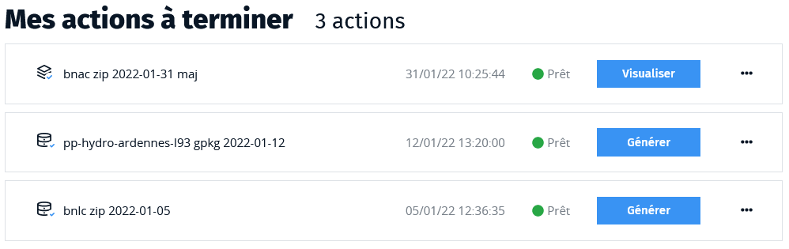
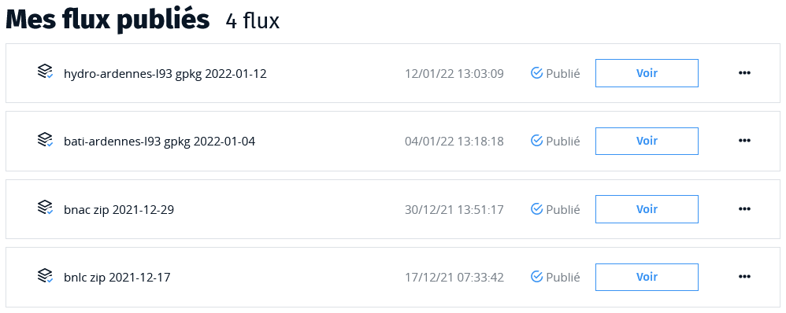

# Espace de travail

Un **espace de travail** est un espace privé qui peut être accessible par plusieurs utilisateurs : ses **membres**. Il dispose de plusieurs espaces de stockages qui ont chacun un rôle bien précis pour héberger :

* les fichiers de données que vous y téléversez,
* les bases de données vecteur dans lesquelles vos données sont intégrées,
* les pyramides de tuiles vectorielles que vous générez et diffusez,
* les fichiers de styles, qui, associés à vos tuiles vectorielles, permettent d'en offrir un rendu cartographique.
  
Chacun de ces espaces de stockage dispose d'un quota que vous ne pouvez pas dépasser. S'il s'avère insuffisant pour votre usage, n'hésitez pas à le signaler via le formulaire de contact.

Le nombre de flux que vous pouvez publier dans un espace de travail est également limité par un quota.

Pour un espace de test, ces quotas sont très limités : moins de 100Mo par espace de stockage et 2 flux publiés.

## Demander un nouvel espace de travail

Si vous souhaitez un espace de travail vous devez en faire la demande en utilisant le formulaire de contact du site.

Précisez dans la mesure du possible :

* quel nom vous souhaitez donner à votre espace de travail (cela peut-être le nom de votre organisme par exemple),
* combien de flux de tuiles vectorielles vous allez publier dans cet espace,
* quel volume de données cela représente environ.

Nous vous répondrons pour affiner votre besoin et vous proposer un espace correctement dimensionné.

## Le tableau de bord :id=dashboard

Le tableau de bord de votre espace de travail permet en un seul coup d'oeil de visualiser tout ce qui s'y passe. Il est organisé en trois parties :

1. Actions à terminer
2. En cours
3. Mes flux

### Actions à terminer

Sont listées ici toutes vos données dans des états intermédiaires, qui ne sont
pas encore disponibles sous forme de flux. Il peut s'agir :

* de bases de données qu'il faut transformer en pyramides de tuiles vectorielles

* de pyramides de tuiles vectorielles qu'il faut publier

* d'échantillons qu'il faut valider

* de mises à jour qu'il faut approuver ou rejeter

* de pyramides de tuiles vectorielles dont la génération à échoué : vous pouvez alors prendre connaissance du rapport avant de supprimer les données (recommandé pour ne pas remplir votre espace de travail inutilement)

### En cours

Vous trouverez dans cette partie la liste des traitements qui sont en cours lorsque ceux-ci sont long. C'est notamment le cas de la génération des tuiles vectorielles. Sur des données volumineuses ou sur une grande étendue géographique, le traitement peut prendre plusieurs dizaines de minutes.

La seule interaction possible avec ces éléments est d'en voir l'avancement.

### Mes flux

Cette liste détaille tous les flux qui ont été publiés à partir de cet espace de travail. Ces flux sont disponibles publiquement et sont accompagnés de métadonnées et optionnellement de styles.

Vous pouvez dans cette liste les consulter pour les partager (action principale), en modifier les métadonnées et les styles, les dépublier voire les supprimer totalement ou entamer un processus de mise à jour.

## La liste des membres

le Géotuileur vous permet uniquement de consulter la liste des utilisateurs ayant accès à votre espace de travail mais pas d'ajouter ou de supprimer des utilisateurs. Vous devrez en faire la demande en utilisant le formulaire de contact.

## La gestion de l'espace

A côté de votre tableau de bord, vous disposez d'une interface de gestion de votre espace de travail qui présente toutes vos données d'une façon différente et rend compte de l'espace qu'elles occupent et des quotas qui sont alloués à chacun des types de stockage à disposition.

!> Lorsque vous atteignez 90% de l'un des quotas, un bandeau d'avertissement s'affiche en haut de toutes les pages pour vous en informer.

La principale action disponible sur cette page est la **suppression de vos données**.

Si tout se passe bien, chaque étape du processus de création d'un flux de tuiles vectorielles supprime les données intermédiaires qui ne lui sont plus utile (pour un flux publié, il ne doit rester que la pyramide de tuiles elle-même mais la base de données intermédiaire et le fichier original que vous avez téléversé devraient avoir été supprimés). Il peut cependant arriver que la suppression automatique se déroule mal et cette page peut vous aider à investiguer et à "faire de la place".